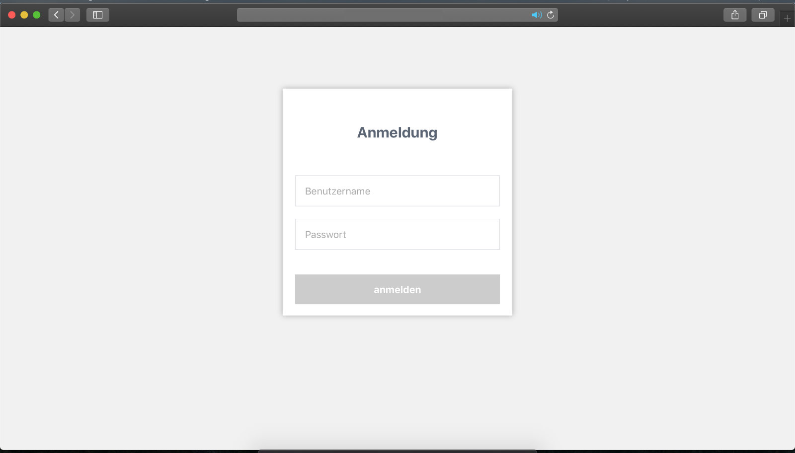
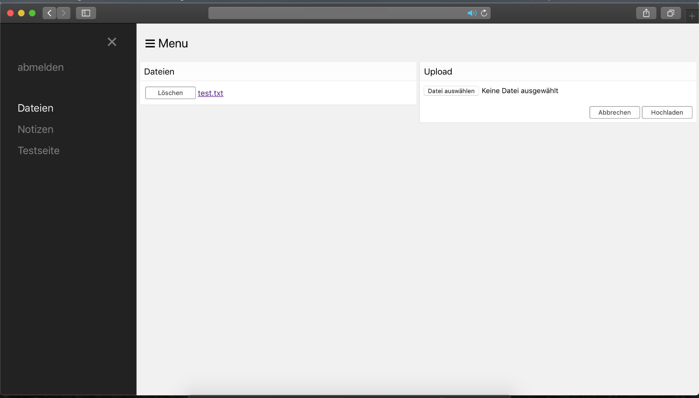
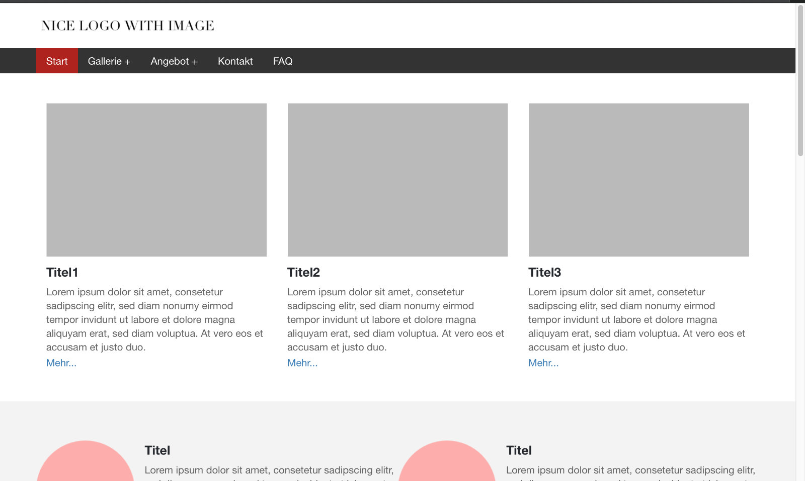
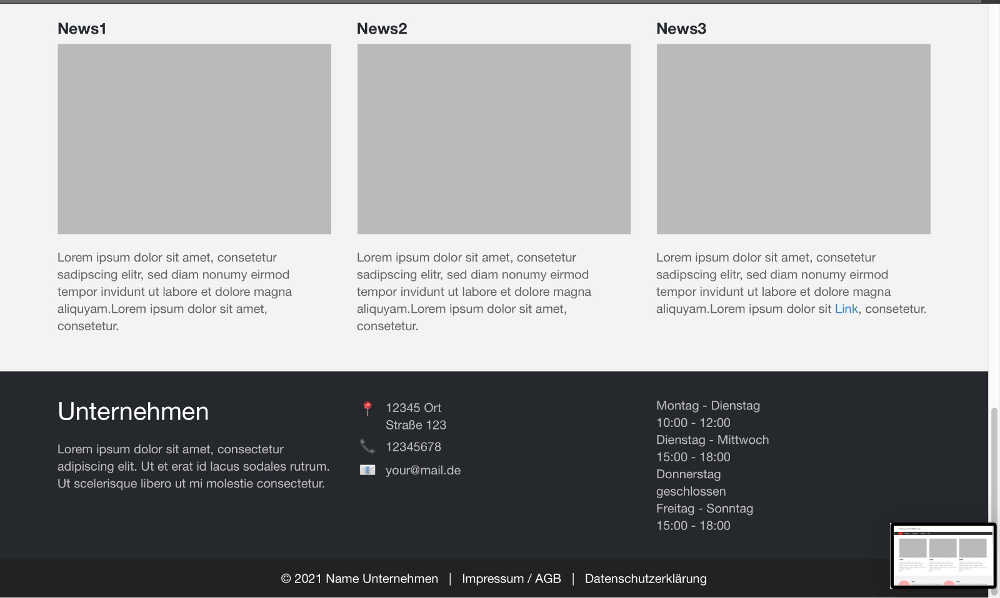
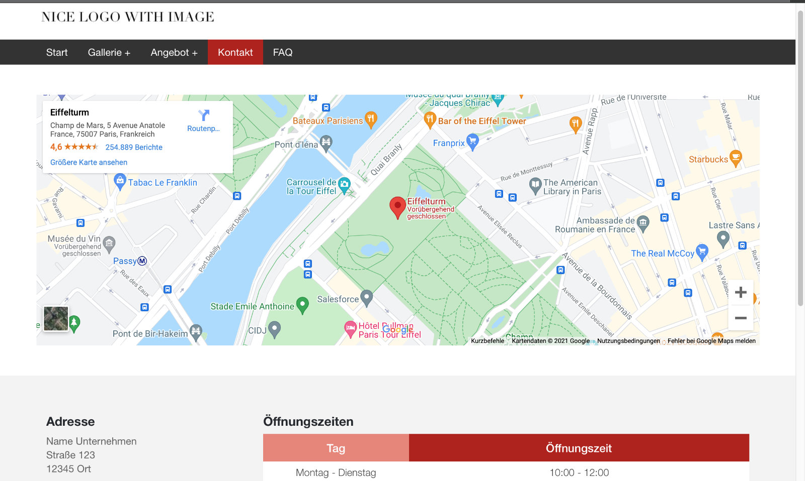
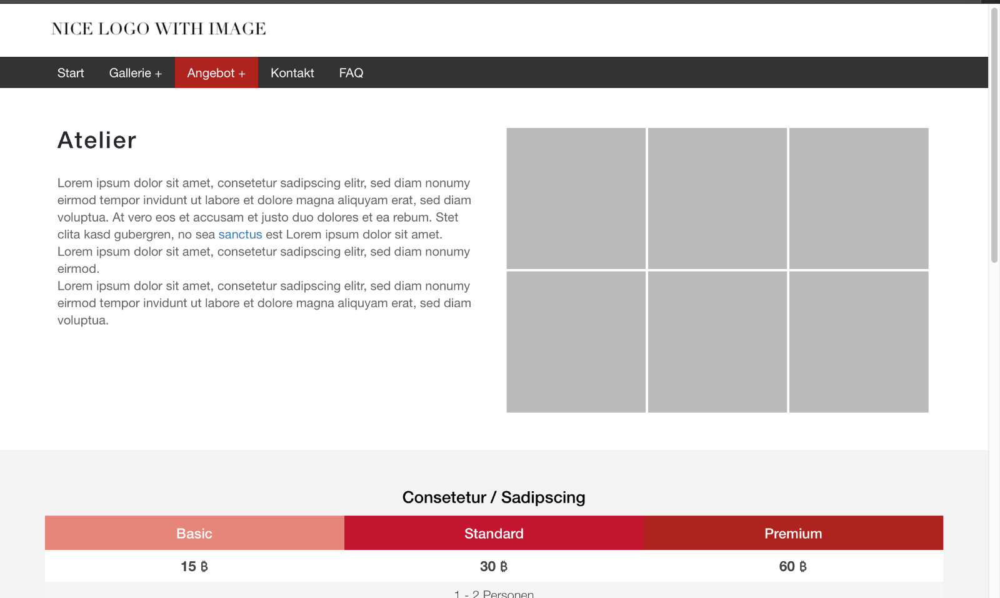
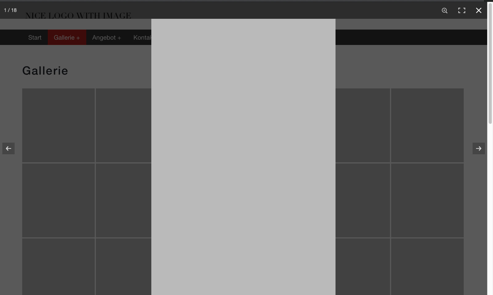
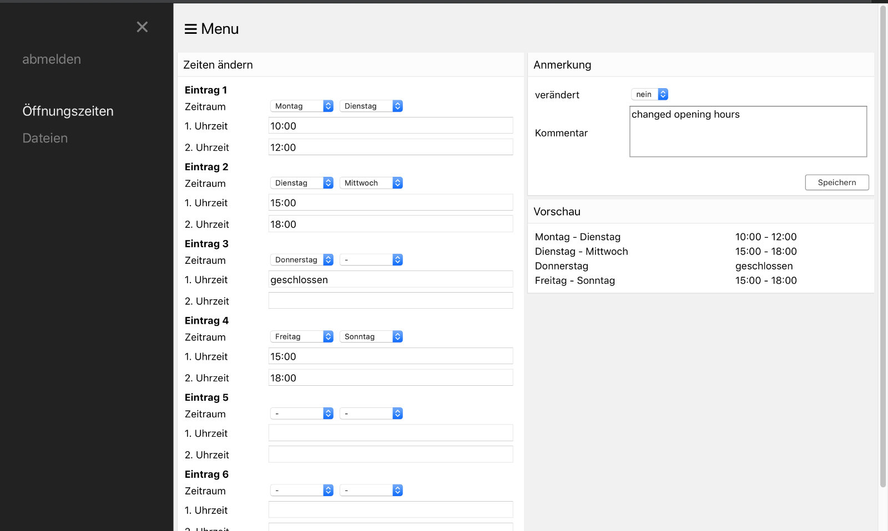

#### Login-Upload-Notes
As the name suggest the webpage lets you manage files and notes in a fairly basic way. Note that the files are accessible to anyone. However, the notes are saved in a database and are therefore only readable if you are logged in. The webpage requires two tables in a database.

  
   
  

#### Simple Webpage for Small Businesses (light weight)
Lets you present your offer, location, contact, faq. You can easily change the opening hours without any knowledge of HTML. Just enter the url of the website (e.g. www dot domain dot de) and add '/Verwaltung'. The currrent login is 'user' with the password '1234'.

The favicon of this webpage has been created with https://realfavicongenerator.net/.

  
   
  
  
  
  

